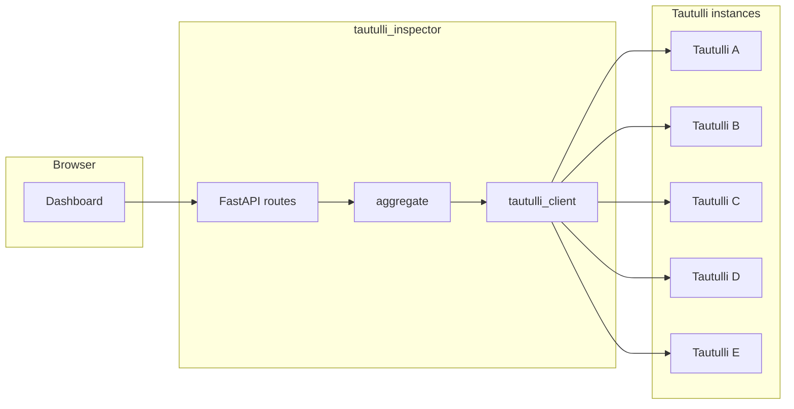

# Architecture

## Overview

`tautulli-inspector` provides a lightweight FastAPI dashboard that aggregates read-only data from multiple Tautulli instances into a single operator view.

Primary MVP goals:

- Unified live activity list (`get_activity`) across all configured servers.
- Unified history list (`get_history`) with globally correct ordering.
- Server health visibility (ok/timeout/http error) even during partial upstream failures.
- Episode/movie staleness insights per server and cumulative from merged history index.
- TV library-joined insights for shows/seasons/episodes with zero plays in index window.

## System design

The app uses a fan-out and merge model:

1. API route receives dashboard request.
2. Aggregator issues parallel upstream requests through a shared Tautulli client.
3. Responses are normalized into a common row shape with `server_id`.
4. Aggregated datasets are sorted and returned to Jinja templates.
5. UI renders merged data and per-server health strip.

## Proposed module layout

```text
tautulli-inspector/
  README.md
  TODO.md
  .env.example
  docs/
    ARCHITECTURE.md
    TAUTULLI_API.md
    DECISIONS.md
  src/tautulli_inspector/
    main.py
    settings.py
    tautulli_client.py
    aggregate.py
    routes_dashboard.py
    templates/
```

## Data flow



## Identity and key assumptions

- Server list is static configuration at startup.
- Plex/Tautulli user identifiers are assumed aligned enough for merged operator views.
- Every merged row carries `server_id` (and ideally `server_name`) to prevent ambiguity and support future drift handling.

## Merge rules

### Live activity

- Fetch `get_activity` from all servers in parallel.
- Flatten each server's `sessions` array into a shared list.
- Attach `server_id` to each session row.
- Recommended default sort: `user` ascending, then title fields.
- Display server health independently from merged list size.

### History

Implemented strategy:

- Request history from each server using Tautulli `after` / `before` when the UI selects a time window (default: rolling N UTC days on `/history`).
- Page through `get_history` with small `length`, bounded concurrency, per-request delay, and extra inter-page sleep for gentle upstream load (especially in all-time mode).
- Normalize each history row to a canonical UTC epoch (`canonical_utc_epoch`) using `started`, `date`, or fallback datetime fields.
- Merge all rows and sort descending by canonical epoch.
- Per-server status cards in the history UI are sorted by display name (then `server_id`) so order stays stable across refreshes and cache hits.
- Apply optional date range filter on normalized epoch.
- Apply global pagination (`start`, `length`) after merge.

This global merge-sort approach is more correct than shared per-server offsets, which can produce incorrect timeline slices.

When the optional SQLite history page cache is enabled, snapshots that include timed-out upstream servers schedule a background refetch with the same exponential backoff used on the live activity dashboard (`HISTORY_TIMEOUT_RETRY_SECONDS` base interval). The history template surfaces a countdown until that retry runs.

## Failure modes and resilience

- Timeout on one server: include warning status; continue rendering available data.
- HTTP/API error on one server: include warning status; continue rendering available data.
- Invalid payload from one server: treat as degraded server result; continue.
- All servers down: show empty tables plus clear health/error banner.

The dashboard should never fail hard solely due to one upstream node.

## Operational constraints

- Request timeout target: 5-10 seconds per upstream call.
- Enforce connection limits and reuse HTTP client sessions.
- Log upstream latency and failure reasons per server for troubleshooting.
- Reduce repeated fan-out load with short-lived in-memory cache on live activity.
- Throttle fan-out pressure with configurable server concurrency cap and per-request delay.

## Known pitfalls and mitigations

- **Global pagination correctness**: per-server `start`/`length` windows can miss records needed for a true global page. Mitigate by over-fetching per server and trimming after global merge, or by introducing cached/ETL-backed pagination when scale increases.
- **Timestamp normalization drift**: history rows may expose different timestamp fields (`started`, `date`) and formats/timezones. Mitigate by converting to one canonical UTC epoch field before sort and render.
- **Identity mismatch across servers**: same person may have different names/ids across instances. Mitigate by displaying `server_id`/`server_name` everywhere and documenting that user-level filters are best-effort until an explicit identity map is added.
- **API key exposure in logs**: Tautulli uses query-string keys, which are easy to leak in request logs and error traces. Mitigate by redacting `apikey` in all logs and avoiding raw URL logging.
- **Fan-out refresh load**: frequent dashboard polling can multiply upstream calls and stress smaller hosts. Mitigate with short-lived in-memory caching for activity/history and optional staggered refresh intervals.
- **Fan-out refresh load**: frequent dashboard polling can multiply upstream calls and stress smaller hosts. Mitigate with short-lived in-memory stale-while-revalidate cache for activity and optional staggered refresh intervals.
- **Partial outage ambiguity**: operators can misread missing rows as "no activity" when a server is degraded. Mitigate by making server health state prominent and time-stamping last successful fetch per server.

For ongoing tracking, see the explicit risk register in `docs/KNOWN_ISSUES.md`.

## Optional future ETL path

If global history scale grows, introduce periodic ingestion into local storage (for example SQLite/PostgreSQL) and serve dashboard queries from that store while retaining upstream fallback for recent/live data.

Current implementation includes an optional SQLite page cache for `/history` responses (TTL-based) to reduce repeated fan-out for identical query/filter windows. When the cache path is unset, `/history` still awaits a full merge per request so server health cards and the table stay populated. Per-server cards show the last time this process completed a successful `get_history` for that `server_id` (in-memory, reset on app restart).

The `/insights/unwatched` report is history-index based: it identifies stale candidates from rows returned by `get_history` and cannot include media items that never appear in history.

The `/insights/library-unwatched` report performs inventory traversal (`get_libraries` -> `get_library_media_info` -> `get_children_metadata`) and joins episode inventory to episode history in the index window to identify shows/seasons/episodes with no watches in that window.

Optional **Sonarr** integration (see `docs/SONARR.md`) adds per-row actions: **Unmonitor**, **Remove & unmonitor**, **Delete**, plus **ⓘ** status (monitored state, file paths). Rows carry a TVDB id when Plex metadata uses the TheTVDB agent. On **per-server** tables, when Plex is configured under **`/settings`**, **Remove & unmonitor** and **Delete** call Sonarr first then the Plex API for the same `ratingKey` (see `docs/PLEX_API_LIBRARY_REMOVAL.md`).

For cumulative TV unwatched output, identities are normalized across servers (show title + season/episode coordinates) so results are globally deduplicated; any watch on any server during the index window excludes that show/season/episode from cumulative unwatched lists.

To avoid long blocking scans on large libraries, TV inventory indexing is incremental:

- each request processes only a configured show chunk per server section
- chunk results are persisted in SQLite inventory cache
- section cursors (`next_start`) advance until completion, then wrap for refresh
- report uses cached inventory built so far and displays indexing progress
- server-identification panels are standardized to the history-page card grid sizing across dashboard pages for consistent operations UI

Insights pages (`/insights/unwatched`, `/insights/library-unwatched`) use background snapshot refresh with persisted cache (3-hour TTL by default). When a snapshot is missing or expired, the page renders quickly in pending mode and auto-refreshes until the background job materializes the cached payload. The library-unwatched cache key seed includes a version token so older SQLite rows are ignored after incompatible payload changes; the page also normalizes each `per_server` row (non-empty `status`, default `inventory_counts`) so the Server Index Status block never renders an empty status label for legacy snapshots.

The **`/settings`** page edits a JSON file (`DASHBOARD_CONFIG_PATH`, default under `./data/`) with two sections: `presentation` (site title, one of five themes, optional logo file under `uploads/`, footer and nav note) and `overrides` (subset of application `Settings` merged over environment on each `get_settings()` call). See `docs/CONFIGURATION.md`. Environment-only values remain LRU-cached per process via `_settings_from_env()`; the merged settings read the JSON file without a separate merge cache.
